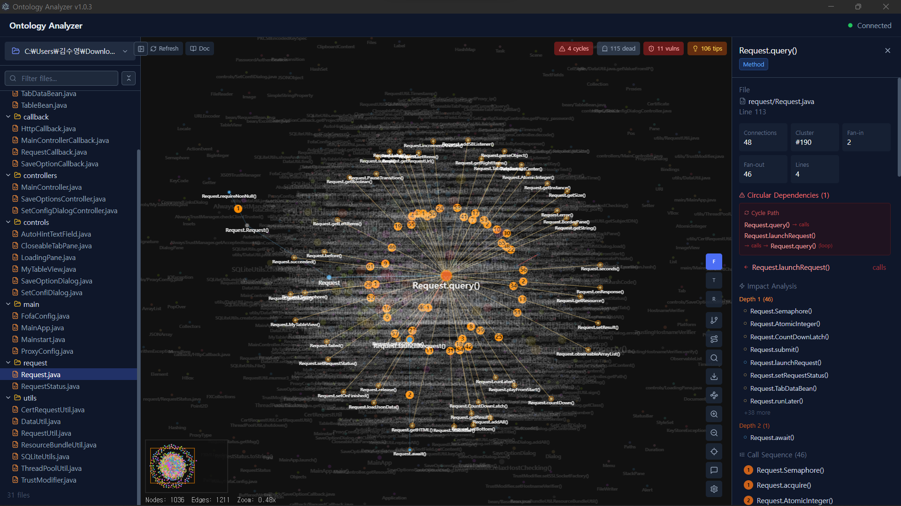

# Ontology Analyzer

**AST-based code structure visualization, security scanning & LLM-assisted analysis desktop application**

Ontology Analyzer parses source code using regex-based AST analysis, builds a dependency graph, and renders it as an interactive force-directed visualization. It detects circular dependencies, dead code, and security vulnerabilities. Includes Mermaid diagram export (Class / Flowchart / Sequence) and LLM chat integration — all in a native Electron desktop app.


<p align="center">
  
</p>

---

## Features

### Code Structure Visualization
- **Force-directed graph** with real-time physics simulation (spring-damper model)
- **3 layout algorithms**: Force, Tree (hierarchical), Radial
- **Interactive canvas**: Pan, zoom, drag nodes, click to inspect
- **Minimap** (bottom-right) for navigation in large graphs
- **Cluster coloring** via label propagation community detection
- **Code preview on hover**: Shows source code snippet around the hovered node

### Analysis Capabilities
- **Circular dependency detection** — DFS back-edge algorithm, highlighted with red dashed edges
- **Dead code detection** — Methods/functions with zero incoming call edges, shown as gray dashed nodes
- **Security vulnerability scanning** — Semgrep-based SAST with bundled custom rules
- **Impact analysis** — BFS-based scope highlighting (3 levels deep) from any selected node
- **Complexity metrics** — Fan-in, Fan-out, Lines of code per node

### Mermaid Diagram Export
- **Class Diagram** — Classes, interfaces, inheritance/implementation relationships, methods
- **Flowchart** — Call graph between methods/functions/classes (LR direction)
- **Sequence Diagram** — Ordered call sequences with participant declaration
- Interactive preview with zoom, search, and copy-to-clipboard
- File-based filtering to generate diagrams for specific files

### LLM Chat Integration
- **OpenAI-compatible** — OpenAI, Ollama (local), Azure OpenAI, and any OpenAI API-compatible endpoint
- **Anthropic** — Claude API
- **Google Gemini** — Gemini API
- Context-aware chat with code analysis data (nodes, edges, vulnerabilities, selected node)
- Streaming SSE responses with real-time output

### Supported Languages
| Language | Extensions | Parsing |
|----------|-----------|---------|
| Java | `.java` | Classes, interfaces, methods, inheritance, call graph |
| Python | `.py` | Modules, classes, functions, imports |
| TypeScript / JavaScript | `.ts` `.tsx` `.js` `.jsx` `.mjs` | Modules, classes, functions, imports |
| Go | `.go` | Functions, imports |
| C / C++ | `.c` `.cpp` `.cc` `.h` `.hpp` | Functions, includes |

### File Selection
- **Open Folder**: Recursively scan an entire directory
- **Open Files**: Pick specific source files for targeted analysis (multi-select)

---

## Offline Installation

The packaged installer (`.exe`) includes **all** dependencies bundled:

- **Backend** (Python FastAPI + Uvicorn) — bundled via PyInstaller
- **Security scanner** (Semgrep + semgrep-core) — bundled via PyInstaller
- **LLM SDK** (OpenAI, Anthropic, Google Generative AI) — bundled via PyInstaller
- **Diagram rendering** (Mermaid.js) — bundled in the frontend

No `pip install`, `npm install`, or internet connection is required to run the installed application. Just install and use.

> Note: LLM chat features require network access to the LLM API endpoint (or a local Ollama instance).

---

## Architecture

```
+-----------------------------------------------------------+
|                    Electron (Main Process)                   |
|  electron/main.ts -- Window, IPC handlers, backend spawn    |
+----------+--------------------------------------+----------+
           | IPC (select-folder, select-files)     |
           v                                       v
+------------------------+        +----------------------------+
|   React Frontend       |  HTTP  |   Python FastAPI Backend    |
|   (Renderer Process)   |<------>|   port 8766                |
|                        |        |                            |
|  +------------------+  |        |  /api/ontology/analyze     |
|  | OntologyPanel    |  |        |  /api/ontology/list-files  |
|  |  +- FileList     |  |        |  /api/ontology/code-prev   |
|  |  +- Graph        |  |        |  /api/chat                 |
|  |  +- Properties   |  |        |  /api/chat/test            |
|  +------------------+  |        |  /api/health               |
|  +------------------+  |        |                            |
|  | ChatPanel        |  |        |  Parsers: Java, Python,    |
|  |  +- ChatMessage  |  |        |  TS/JS, Go, C/C++          |
|  |  +- LLMSettings  |  |        |  Semgrep integration       |
|  +------------------+  |        |  LLM: OpenAI, Anthropic,   |
|                        |        |       Gemini               |
|  Vite + Tailwind CSS   |        +----------------------------+
+------------------------+
```

### Frontend (`src/`)
| Component | Description |
|-----------|-------------|
| `App.tsx` | Root component, backend health polling |
| `OntologyPanel.tsx` | Main orchestrator -- state management, API calls, toolbar, Mermaid export |
| `OntologyFileList.tsx` | Left panel -- folder/file selector, file tree with search |
| `OntologyGraph.tsx` | Center panel -- Canvas-based graph rendering with physics engine |
| `OntologyProperties.tsx` | Right panel -- Node details, metrics, vulnerability list |
| `LLM/ChatPanel.tsx` | LLM chat panel with streaming responses |
| `LLM/ChatMessage.tsx` | Chat message rendering with Markdown support |
| `LLM/LLMSettingsModal.tsx` | LLM provider configuration modal |

### Backend (`backend/`)
| File | Description |
|------|-------------|
| `main.py` | FastAPI app with CORS middleware |
| `api/routes_ontology.py` | Code analysis endpoints -- parsing, analysis, Semgrep scanning |
| `api/routes_chat.py` | LLM chat endpoints -- streaming SSE, multi-provider support |
| `security/semgrep-rules.yml` | Bundled security rules (SQL injection, XSS, hardcoded secrets, etc.) |

---

## Getting Started

### Prerequisites
- **Node.js** >= 18
- **Python** >= 3.10
- **pip packages**: `pip install -r backend/requirements.txt`
- **Semgrep** (optional, for vulnerability scanning): `pip install semgrep`

### Install Dependencies

```bash
# Frontend
npm install

# Backend (includes all dependencies: FastAPI, Uvicorn, OpenAI, Anthropic, Gemini)
pip install -r backend/requirements.txt

# Optional: Security scanning
pip install semgrep
```

### Development

**Option 1: Quick start (Windows)**
```bash
start.bat
```
This starts both the backend and Electron app automatically.

**Option 2: Manual start**
```bash
# Terminal 1 -- Backend
python -m uvicorn backend.main:app --host 127.0.0.1 --port 8766

# Terminal 2 -- Electron + Vite
npm run electron:dev
```

**Option 3: Frontend only (browser)**
```bash
# Terminal 1 -- Backend
python -m uvicorn backend.main:app --host 127.0.0.1 --port 8766

# Terminal 2 -- Vite dev server
npm run dev
# Open http://localhost:5174
```

---

## Build & Package

### Full Production Build (Windows)

```bash
build.bat
```

This runs 5 steps:
1. **PyInstaller** -- Bundles Python backend + LLM SDKs into `dist-backend/main/main.exe`
2. **PyInstaller** -- Bundles Semgrep scanner into `dist-semgrep/semgrep/semgrep.exe`
3. **Vite** -- Builds React frontend into `dist/`
4. **TypeScript** -- Compiles Electron main process into `dist-electron/`
5. **electron-builder** -- Packages everything into NSIS installer

### Individual Steps

```bash
# Backend only
pyinstaller main.spec --noconfirm --distpath dist-backend

# Semgrep only
pyinstaller semgrep.spec --noconfirm --distpath dist-semgrep

# Frontend only
npx vite build

# Electron TypeScript only
npx tsc -p tsconfig.electron.json

# Package only (requires steps 1-4 first)
npx electron-builder --win
```

### Output
```
release/
  Ontology Analyzer Setup {version}.exe    # NSIS installer
```

---

## Usage Guide

### Basic Workflow
1. Launch the app
2. Click **"Select folder or files..."** (top-left)
3. Choose **Open Folder** to scan a project, or **Open Files** to pick specific files
4. Wait for analysis to complete (file list + graph appear)
5. Interact with the graph -- click nodes, hover for code preview

### Graph Interaction
| Action | Effect |
|--------|--------|
| **Click node** | Select -- opens Properties panel on the right |
| **Hover node** | Shows code preview tooltip after 400ms |
| **Drag node** | Repositions node (force layout re-stabilizes) |
| **Scroll wheel** | Zoom in/out |
| **Click + drag background** | Pan the canvas |
| **Ctrl+F** | Open node search |
| **Esc** | Close search / clear selection |

### Layout Modes
| Mode | Button | Description |
|------|--------|-------------|
| **Force** | `F` | Spring-damper physics simulation (default) |
| **Tree** | `T` | Hierarchical top-down layout |
| **Radial** | `R` | Circular layout with root at center |

### Status Badges (top-right)
| Badge | Meaning |
|-------|---------|
| **N cycles** | Circular dependencies detected -- click to navigate |
| **N dead** | Unreferenced methods/functions -- click to navigate |
| **N vulns** | Security vulnerabilities found -- click to navigate |

### Toolbar (bottom-right)
- **F / T / R** -- Layout mode selector
- **Inheritance tree** icon -- Filter to show only extends/implements relationships
- **Search** icon -- Toggle node search (Ctrl+F)
- **Focus** icon -- Reset view to fit all nodes
- **Export** icon -- Download graph as PNG
- **Mermaid** icon -- Export as Class / Flowchart / Sequence diagram
- **Zoom +/-** -- Zoom controls

### Mermaid Diagram Export
1. Click the **Mermaid** icon in the toolbar
2. Select diagram type: **Class Diagram**, **Flowchart**, or **Sequence Diagram**
3. The diagram renders with interactive preview (zoom in/out, search)
4. Click specific files in the file list to filter the diagram
5. Use **Copy** to copy Mermaid code to clipboard

### LLM Chat
1. Click the **Chat** icon to open the chat panel
2. Configure an LLM provider via the settings gear icon:
   - **OpenAI** -- API key + model (e.g., `gpt-4o`)
   - **Ollama** -- Local endpoint (e.g., `http://localhost:11434/v1`)
   - **Anthropic** -- API key + model (e.g., `claude-sonnet-4-5-20250514`)
   - **Google Gemini** -- API key + model (e.g., `gemini-pro`)
3. The chat automatically includes code analysis context (graph summary, selected node, vulnerabilities)
4. Ask questions about your code structure, dependencies, or security issues

### Properties Panel (right sidebar)
When a node is selected, the panel shows:
- **Node type** and file location
- **Complexity metrics**: Fan-in, Fan-out, Lines of code
- **Connected nodes**: Incoming and outgoing edges with clickable navigation
- **Call order**: Sequential call numbering within methods
- **Impact scope**: BFS-highlighted nodes within 3 levels
- **Vulnerabilities**: Semgrep findings associated with the node

---

## Security Scanning

Ontology Analyzer integrates [Semgrep](https://semgrep.dev/) for static application security testing (SAST).

### Bundled Rules
The file `backend/security/semgrep-rules.yml` includes custom rules for:
- **SQL Injection** -- String formatting, f-strings, concatenation in queries
- **Cross-Site Scripting (XSS)** -- Unsafe template rendering
- **Hardcoded Credentials** -- Passwords, API keys, tokens in source
- **Command Injection** -- Unsafe `os.system()`, `subprocess` calls
- **Path Traversal** -- Unsanitized file path inputs
- And more across Python, Java, JavaScript, Go, C/C++

### How It Works
1. After code structure analysis completes, Semgrep runs in parallel
2. Results are mapped to the nearest enclosing node (class/method/function)
3. Vulnerable nodes get a `vulnCount` badge on the graph
4. Click the **vulns** badge (top-right) to navigate through findings
5. Full details appear in the Properties panel

> Note: In the packaged installer, Semgrep is fully bundled. No separate installation needed.

---

## Project Structure

```
ontology-analyzer/
+-- electron/                  # Electron main process
|   +-- main.ts                # App entry, window, IPC, backend spawn
|   +-- preload.ts             # Context bridge (electronAPI)
+-- src/                       # React frontend
|   +-- App.tsx                # Root component
|   +-- api/
|   |   +-- client.ts          # API client (fetch wrapper)
|   |   +-- llmClient.ts       # LLM API client (SSE streaming)
|   +-- components/
|   |   +-- Ontology/
|   |   |   +-- OntologyPanel.tsx       # Main orchestrator + Mermaid export
|   |   |   +-- OntologyFileList.tsx    # File tree + selector
|   |   |   +-- OntologyGraph.tsx       # Canvas graph renderer
|   |   |   +-- OntologyProperties.tsx  # Node details panel
|   |   +-- LLM/
|   |       +-- ChatPanel.tsx           # Chat panel
|   |       +-- ChatMessage.tsx         # Message rendering
|   |       +-- LLMSettingsModal.tsx    # Provider settings
|   +-- hooks/
|   |   +-- useChatHistory.ts   # Chat history hook
|   |   +-- useLLMSettings.ts   # LLM settings hook
|   +-- types/
|       +-- electron.d.ts       # Electron API types
|       +-- llm.ts              # LLM type definitions
+-- backend/                    # Python FastAPI backend
|   +-- main.py                 # FastAPI app
|   +-- requirements.txt        # Python dependencies
|   +-- api/
|   |   +-- routes_ontology.py  # Code analysis endpoints
|   |   +-- routes_chat.py      # LLM chat endpoints
|   +-- security/
|       +-- semgrep-rules.yml   # Custom SAST rules
+-- start.bat                   # Dev launcher (Windows)
+-- build.bat                   # Production build script
+-- main.spec                   # PyInstaller spec (backend + LLM SDKs)
+-- semgrep.spec                # PyInstaller spec (Semgrep)
+-- package.json                # Node.js dependencies
+-- electron-builder.yml        # Packaging configuration
+-- vite.config.ts              # Vite configuration
+-- tailwind.config.mjs         # Tailwind CSS configuration
+-- tsconfig.json               # TypeScript config (frontend)
+-- tsconfig.electron.json      # TypeScript config (Electron)
+-- index.html                  # HTML entry point
```

---

## Tech Stack

| Layer | Technology |
|-------|-----------|
| **Desktop** | Electron 31 |
| **Frontend** | React 18 + TypeScript 5.5 |
| **Build Tool** | Vite 5.4 |
| **Styling** | Tailwind CSS 3.4 |
| **Icons** | Lucide React |
| **Diagrams** | Mermaid.js |
| **Backend** | Python 3.12 + FastAPI 0.115 |
| **ASGI Server** | Uvicorn |
| **Security Scanner** | Semgrep (bundled) |
| **LLM Integration** | OpenAI SDK, Anthropic SDK, Google Generative AI |
| **Bundler (Backend)** | PyInstaller |
| **Packager** | electron-builder (NSIS) |

---

## API Endpoints

| Method | Path | Description |
|--------|------|-------------|
| `GET` | `/api/health` | Health check |
| `POST` | `/api/ontology/analyze` | Analyze code structure + vulnerabilities |
| `POST` | `/api/ontology/list-files` | List supported source files |
| `POST` | `/api/ontology/code-preview` | Get code snippet around a line number |
| `POST` | `/api/chat` | Chat with LLM (streaming SSE) |
| `POST` | `/api/chat/test` | Test LLM provider connection |

### Request/Response Examples

**POST /api/ontology/analyze**
```json
// Request
{ "path": "C:/projects/my-app", "files": null }

// Response
{
  "nodes": [
    { "id": "class:UserService", "label": "UserService", "type": "class",
      "file": "src/services/UserService.java", "line": 15,
      "cluster": 0, "size": 5, "fanIn": 3, "fanOut": 7,
      "lines": 120, "dead": false, "vulnCount": 1 }
  ],
  "edges": [
    { "source": "class:UserService", "target": "class:UserRepository",
      "type": "calls", "order": 0, "circular": false }
  ],
  "vulnerabilities": [
    { "rule": "sql-injection-format", "severity": "critical",
      "message": "SQL injection via string formatting",
      "line": 42, "file": "src/services/UserService.java",
      "nodeId": "method:UserService.findByName" }
  ]
}
```

**POST /api/chat**
```json
// Request
{
  "messages": [{ "role": "user", "content": "Explain the circular dependencies" }],
  "provider": {
    "provider_id": "openai",
    "api_key": "sk-...",
    "model": "gpt-4o",
    "endpoint_url": "https://api.openai.com/v1",
    "api_format": "openai"
  },
  "context": { "graphSummary": { "totalNodes": 42, "cycleCount": 3 } },
  "stream": true
}

// Response: Server-Sent Events stream
data: {"content": "The circular dependencies..."}
data: {"content": " involve three nodes..."}
data: [DONE]
```

---

## Changelog

### v1.0.3
- Bundle all Python dependencies (Semgrep, LLM SDKs) in installer for fully offline use
- No separate `pip install` required -- security scanner and LLM integration work out of the box
- Add LLM chat integration (OpenAI, Anthropic, Google Gemini, Ollama)
- Add Mermaid diagram export (Class Diagram, Flowchart, Sequence Diagram)

### v1.0.2
- Bundle Semgrep for offline use
- Add multi-file selection (Open Files)

### v1.0.1
- Add multi-file selection support

---

## License

MIT
